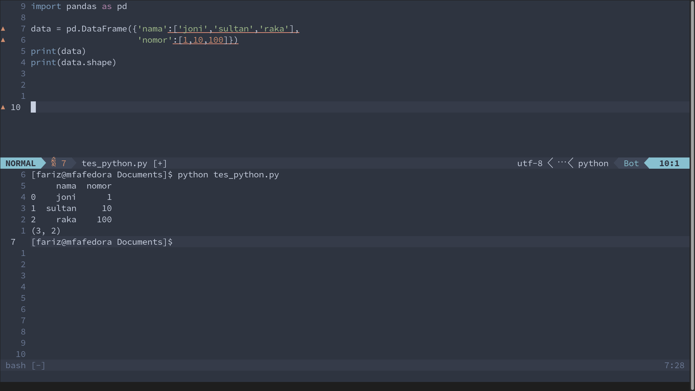

# Nevom Setup

This is Neovim config for my personal **Data Science** daily usecase.

**Neovim** is a terminal based editor that is really powerfull. It uses keyboard shortcut to navigate and can be configured as much as we like.

I'm using Fedora Linux as the host operating system.

## Installing Software

* install neovim : sudo dnf install neovim
